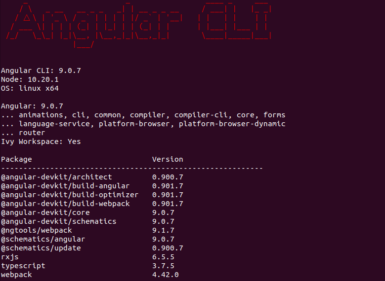

# Portfolio

This project was forked from [Angular In Action Chapter 6](https://github.com/angular-in-action/portfolio) and updated to use Angular version 9.

This project was generated with [Angular CLI](https://github.com/angular/angular-cli) version 9.0.7.

## Setup

In the project directory, run `npm install` from a terminal to download dependencies. After downloading is complete, run `ng v` to view the Angular version for the project. The output should be similar to the following screenshot.

<figure>
  
  <figcaption>Figure 1. Angular Version</figcaption>
</figure> 
 

## Development server

Run `ng serve` for a dev server. Navigate to `http://localhost:4200/`. The app will automatically reload if you change any of the source files.

## Shutdown

To stop the application and the API, press Ctrl + C in the terminals where the processes were started.

## Code scaffolding

Run `ng generate component component-name` to generate a new component. You can also use `ng generate directive|pipe|service|class|guard|interface|enum|module`.

## Build

Run `ng build` to build the project. The build artifacts will be stored in the `dist/` directory. Use the `-prod` flag for a production build.

## Running unit tests

Run `ng test` to execute the unit tests via [Karma](https://karma-runner.github.io).

## Running end-to-end tests

Run `ng e2e` to execute the end-to-end tests via [Protractor](http://www.protractortest.org/).
Before running the tests make sure you are serving the app via `ng serve`.

## Further help

To get more help on the Angular CLI use `ng help` or go check out the [Angular CLI README](https://github.com/angular/angular-cli/blob/master/README.md).
